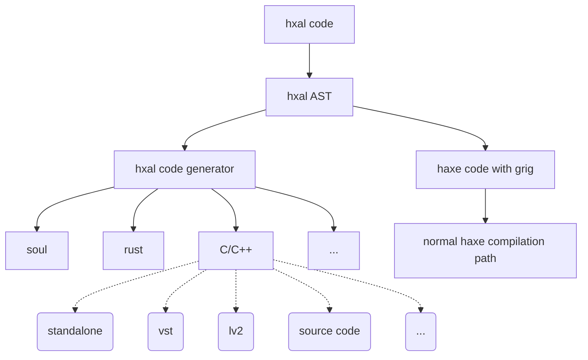

# HXAL

Hxal is an audio-oriented DSL (domain specific programming language) that will be increasingly used by grig.audio to facilitate clean real-time audio code. It solves a number of problems that prevent pre-hxal grig.audio from being usable for real-time audio code. It is in an early stage, but the current focus is on bare minimum but working before we start adding \[carefully thought-out\] features.

## Basic Philosophy of HXAL

A simple DSL for making real-time audio code. It's not meant to be a way to write entire applications, but can be away to make synthesizers, effects, and audio code within larger applications. GUIs, midi and OSC code, music theory stuff, etc. all can be done in plain haxe just fine. It doesn't try to be clever and mathematically perfect but instead practical and more closely resemble most rt audio code in the real world - code that works on block-based callbacks. Importantly, it is syntactically haxe code and should make sense to haxe and c++ developers. One of the first features will be to allow environment-specific inline code so that you can port c++ code right away and move things into hxal when you want to take advantage of non-c++ environments.

It's meant to *get out of the way*, *not be fancy* and, like the haxe language itself, *take advantage of hard work that others already did*. It might not provide as much capabilities out of the box as other things, but it should be relatively easy to port existing code to. It won't start out with every imaginable optimization but it should generate standard-compliant code that compilers can optimize and provide a framework for future hand-optimization.

- When in doubt, don't allow it
- Fewer features, done right
- If it's a bad idea to do something 95% of the time, don't allow it
- Whatever you can't do in hxal you can do in embedded environment-specific code if you must
- Enforce good audio coding practices
- Guarantees of thread safety (for getters/setters), lock-free atomics, etc. take precedence over the haxian guarantee that the transpiler should catch the problem. Sometimes C++/C/Rust has to catch the problem because we don't always know where the code is going anyway (e.g., compiled for embedded processor).

## Problems we need this early version of hxal to fix:

- Some targets let you directly access individual channels, some don't
- Some environments might be interlaced, others not
- We want no unnecessary overhead like a lot of c++ libs add
- We don't have checking for all these convoluted #if typedefs we tend to do in grig (not sure if hxal makes this better or worse)
- We just don't want the haxe compiler to add any abstractions that do have costs
- This is the main thing - performance issues with gc'd code make grig.audio's callback unusable for actual audio applications

## \[Proposed\] Features of HXAL

- Multiple environments, including languages not supported by the haxe compiler
- All numeric types guaranteed to be atomic
- Good defaults built in and prevents you from doing bad things like allocating in the callback
- Can interact with the rest of the haxe world (with automatically made bindings/externs when using pure environments)

### Haxe and non-Haxe Environments

hxal can turn into haxe/grig code that will make use of those externs or it can turn into non-gc'd code generated by the hxal macros, sidestepping haxe's code generation - "pure environments". Glue can be created to the haxe world with larger applications but with "pure" hxal, the hxcpp or hashlink runtimes can be left out. This is good for plugins that don't need the extra executable size needed for runtimes for the haxe language overall.

The narrow scope of hxal also makes support for additional environments fairly straightforward compared to the work needed to make a haxe target.

### Optimization

***

# hxal

[Haxe](https://haxe.org/) Audio Language. A haxe-based DSL for real-time audio applications built using haxe's macro system. Part of [grig](https://haxe.org/).

EARLY STAGE OF DEVELOPMENT. Ignore if you are expecting something you can use right away. Other parts of grig can be used now (grig.midi, grig.audio) but not this.

## Design Goals

* Look and behave like haxe
* Lightweight and simple
* Facilitates two different compilation pathways:
  * Straightforward compilation as haxe code with minimal modification by the macro aside from swapping hxal types for grig types
  * Transpilation straight to non-garbage-colleged targets. Planned:
    * [soul](https://soul.dev/)
    * rust
    * c/c++
* Allows declaration of variables, assignments, arithmetic but prevents allocations and frees, ensuring that the code is suitable for realtime even on gc targets.
* Meant to be easy to port legacy c++ code to, rather than being a radically different paradigm like faust
* Err on the side of simple and works, rather than being clever
* Designed to build atop other's work, in keeping with the general philosophy of haxe.
* All errors should be caught by VSCode and others' error checking. This is just haxe code, after all!
* Per frame and per midi event interface, which easily transforms to soul and, with hxal adding loops, to all the other environments

## Dual Code Paths



## Overview

To create a node that does processing - it can be an instrument or an effect - by creating a class that extends `grig.hxal.Node`. This will automatically bring in the macros that check the code and, as needed, use it to generate code.

```haxe
import grig.hxal.Node;

class SineSynth extends Node
{
}
```

hxal extensively uses compiler metadata for supplying information to different plugin formats. You may add any number of names, along with the ISO 639-1 language code for the translation and a version to the class:

```haxe
@name("Sine Synth", 'en')
@name("サインシンセサイザー", 'jp')
@version("0.0.1")
class SineSynth extends Node
```

In a `Node` class, you can have variables and functions, with some limitations. Currently, access modifiers aren't supported for simplicity (it has no meaning in plugins or non-oo targets). But final keyword is (and encouraged!) All variables, whether class members or defined in functions must be one of the following types:

* `Int`
* `UInt`
* `Int8`
* `UInt8`
* `Int16`
* `UInt16`
* `Int32`
* `UInt32`
* `Int64`
* `UInt64`
* `Float`
* `Float32`
* `Float64`
* `Sample`
* `Array<Type, Length>` in variable declarations or `Array<Type>` in arguments
* `Bool`

`Int` and `UInt` alias to whatever is the fastest int type on the architecture, same with `Float`. `Sample` is whichever format is used for audio samples, *which doesn't necessarily map to another type on the list*.

Class member variables can be marked as parameters using metadata:

```haxe
@parameter
@name("OSC1 Frequency", 'en')
var frequency1:Float;
```

As with the class itself, multiple name, language code pairs are supported for translations.

```haxe
@parameter @name("OSC1 Frequency", 'en') var frequency1:Float;
```