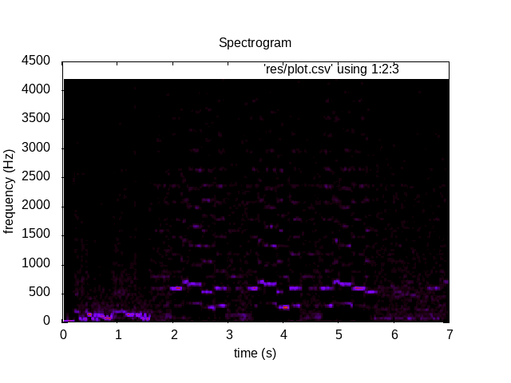

hxdsp
======

A simple (barebones) FFT library implemented in Haxe for cross-platform signal processing.

For more information, read the [current API](https://baioc.github.io/hxdsp/) and check out the [example program](src/Main.hx):
```bash
$ haxe example.hxml
```


TODO:
------
* Set up proper testing.
* Make it a haxelib package.
